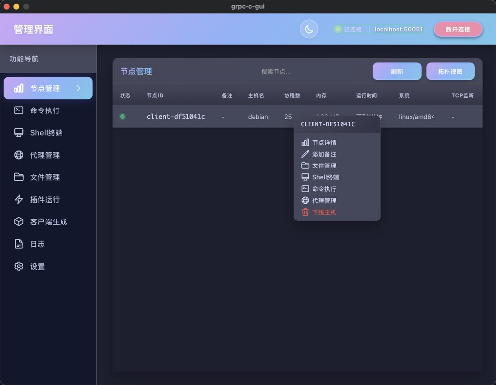

# GRPC-C

基于 gRPC 的分布式远程控制框架，采用纯 Go 实现，支持跨平台部署和多级网络穿透。

**核心特性**：
- **一键部署**：服务端内置客户端生成器，无需预编译客户端
- **安全隐蔽**：进程伪装、加密通信、双进程架构
- **网络穿透**：支持 NAT/防火墙环境，多级转发上线
- **跨平台**：支持 Windows、Linux、macOS
- **一次性 URL**：客户端配置支持一次性下载，下载后自动失效
- **Token 认证**：Loader 支持 Token 验证机制，防止未授权下载
- **证书验证**：内置 TLS 证书验证，确保通信安全
- **多种客户端**：完整版、Loader、C Loader、Shellcode 多种类型

**为防止恶意使用，暂不开放源代码**


---

## ⚠️ 重要声明

**本项目专为网络安全学习、研究及合法渗透测试场景设计开发。**

在使用本工具之前，请您务必仔细阅读并充分理解以下条款：

### 合法使用规范

1. **授权要求**：使用本工具对任何系统进行测试前，必须事先获得该系统所有者的书面授权许可。未经授权的测试行为可能构成违法犯罪。

2. **适用场景**：本工具仅可用于：
   - 授权范围内的安全评估与渗透测试
   - 网络安全技术研究与学习
   - 企业内部合法的安全审计工作
   - 教育培训等合法教学活动

3. **禁止行为**：严禁将本工具用于任何未经授权的非法活动，包括但不限于：
   - 未授权访问他人计算机系统或网络
   - 窃取、破坏或篡改数据
   - 任何形式的网络攻击或破坏行为
   - 其他违反法律法规的行为

### 责任限制

1. **使用者责任**：使用本工具即代表您已完全理解并接受本声明。您需对使用本工具产生的一切后果承担全部责任，包括但不限于数据损失、系统故障、法律纠纷等。

2. **开发者免责**：本项目开发者及贡献者不对因使用、误用或滥用本工具而导致的任何直接或间接损失、损害承担责任，亦不对任何违法使用行为负责。

3. **法律合规**：使用者有义务确保自身行为符合所在地区的法律法规要求。不同国家和地区对网络安全工具的使用有不同的法律规定，请自行了解并遵守。

### 最终解释

- 本工具按"现状"提供，不提供任何明示或暗示的保证
- 开发者保留随时修改或终止本项目的权利
- 继续使用本工具即表示您已阅读、理解并同意遵守本声明的全部内容

**请理性使用，共同维护网络安全环境！**

---

## 部署说明

本框架采用服务端-管理端分离架构，客户端由服务端动态生成。

**部署组件**：
- `grpc-c-server`：服务端程序，负责节点管理和客户端生成
- `grpc-c-manager-gui`：管理端程序，提供图形化管理界面

**部署流程**：
1. 在服务器上运行 `grpc-c-server`
2. 在管理机上运行 `grpc-c-manager-gui`，连接到服务端
3. 通过管理端界面生成目标平台的客户端
4. 将生成的客户端部署到目标主机

---

## 项目架构

### 核心组件

1. **服务端 (Server)**
   - 管理所有客户端节点
   - 内置客户端生成器（支持多平台、多类型）
   - 处理管理端请求
   - 存储客户端模板

2. **管理端 (Manager GUI)**
   - 基于 Wails + Vue.js 的图形界面
   - 连接服务端进行节点管理
   - 生成客户端（通过服务端生成器）
   - 可视化网络拓扑

### 客户端类型（由服务端生成）

- **完整客户端**：双进程架构，功能完整（15-20MB）
- **Loader 加载器**：轻量级启动器，动态下载客户端（~10MB）
- **C Loader**：C 语言实现，体积更小（~700KB）
- **Shellcode 客户端**：内存加载，无文件落地

## 主要功能

### 节点管理
- 节点列表查看与备注
- 网络拓扑可视化
- 节点状态实时监控（CPU、内存等）
- 多级转发上线支持

### 远程控制
- 命令执行（单次/批量）
- 交互式 Shell 终端
- 文件管理（上传/下载/编辑，支持断点续传）
- SOCKS5 代理

### 客户端生成
- 图形化配置界面
- 多平台支持（Windows/Linux/macOS）
- 多种客户端类型（完整版/Loader/C Loader/Shellcode）
- 自定义服务器地址和加密配置

### 安全特性
- **进程伪装**：Linux 内核线程名伪装
- **双进程架构**：看门狗进程 + 主进程，自动重启保活
- **加密通信**：gRPC + TLS 加密，流量混淆
- **自动重连**：主服务器失败后自动切换备用地址

## 技术栈

- **后端**：Go + gRPC + Protobuf
- **前端**：Wails + Vue.js + Element Plus
- **通信**：gRPC 双向流 + TLS
- **跨平台**：Windows / Linux / macOS

---

## 使用说明

### 1. 启动服务端

```bash
./grpc-c-server [-l address:port] [-pwd password] [-log log_file] [-dport port]
```

**参数说明**：
- `-l`：gRPC 监听地址和端口，默认 `0.0.0.0:50051`
- `-pwd`：管理端连接密码（留空使用配置文件密码）
- `-log`：日志文件路径，默认 `logs/server.log`
- `-dport`：HTTPS 分发服务端口（仅端口号），默认 `0.0.0.0:50052`

**示例**：
```bash
# 使用默认配置启动
./grpc-c-server

# 自定义配置启动
./grpc-c-server -l 0.0.0.0:8080 -pwd mypassword -log /var/log/grpc-c.log -dport 8081
```

### 2. 启动管理端

运行 `grpc-c-manager-gui` 图形界面程序：

1. 启动管理端应用
2. 输入服务端地址（如 `192.168.1.100:50051`）
3. 输入连接密码
4. 点击"连接"按钮

### 3. 生成客户端

通过管理端界面生成客户端：

**步骤**：
1. 在管理端界面选择"客户端生成器"
2. 选择目标平台（Windows / Linux / macOS）
3. 选择客户端类型：
   - **完整客户端**：功能完整，双进程架构（15-20MB）
   - **Loader 加载器**：轻量级，动态下载客户端（~10MB）
   - **C Loader**：C 语言实现，体积最小（~700KB）
   - **Shellcode**：内存加载，无文件落地
4. 配置服务器地址和备用地址（可选）
5. 点击"生成"按钮

**配置说明**：
- **主服务器地址**：客户端首次连接的服务器地址
- **备用服务器地址**：主服务器失败后的备用地址（支持加密URL）
- **加密配置**：可选择是否加密配置信息

### 4. 部署客户端

将生成的客户端部署到目标主机：

```bash
# Linux
chmod +x grpc-c-client
./grpc-c-client

# Windows
grpc-c-client.exe
```

**客户端特性**：
- 自动连接到配置的服务器
- 双进程架构（看门狗 + 主进程）
- 进程崩溃自动重启
- 主服务器连接失败自动切换备用地址
- Linux 系统进程名伪装为内核线程

### 5. 管理节点

#### 节点列表
- 查看所有在线节点
- 查看节点详细信息（系统、IP、上线时间等）
- 为节点添加备注标识

#### 命令执行
1. 选择目标节点
2. 输入要执行的命令
3. 查看执行结果

#### 文件管理
1. 选择目标节点
2. 浏览远程文件系统
3. 上传/下载/编辑/删除文件
4. 支持断点续传

#### Shell 终端
1. 选择目标节点
2. 打开交互式终端
3. 实时执行命令

#### SOCKS5 代理
1. 选择目标节点
2. 配置本地监听端口
3. 启动代理服务

#### 网络拓扑
- 可视化查看节点网络结构
- 查看节点转发路径
- 监控节点状态

### 6. 高级功能

#### 多级转发上线
- 节点可通过其他在线节点进行多级转发连接
- 服务端自动识别并建立转发路径
- 适用于复杂网络环境（NAT/防火墙）

#### 备用地址机制
- 主服务器连接失败 10 次后自动切换
- 支持从远程 URL 动态获取备用地址
- 备用地址可加密存储

#### 一次性 URL 机制
- 客户端支持配置一次性下载 URL
- 客户端启动后从 URL 下载配置信息
- 下载成功后自动删除 URL 记录
- 防止配置信息被重复获取
- 适用于临时部署和高安全场景

**工作流程**：
1. 在管理端生成客户端时配置一次性 URL
2. 客户端首次启动时从 URL 下载配置
3. 配置下载成功后，URL 自动失效
4. 后续启动使用本地缓存的配置

#### Token 认证机制
- Loader 下载客户端时需要提供有效 Token
- Token 在生成 Loader 时自动嵌入
- 服务端验证 Token 有效性后才允许下载
- 防止未授权的客户端下载
- Token 支持过期时间

**安全优势**：
- 防止 Loader 被他人滥用
- 控制客户端分发范围
- 可追踪客户端下载记录
- 支持 Token 撤销和更新

#### 证书验证机制
- 内置 TLS 证书验证
- 客户端与服务端双向认证
- 防止中间人攻击
- 证书自动生成和管理
- 支持自定义 CA 证书

**验证流程**：
1. 服务端启动时自动生成 CA 证书
2. 客户端生成时嵌入 CA 证书
3. 连接时验证服务端证书有效性
4. 确保通信双方身份可信

#### 客户端类型对比

| 类型 | 特点 | 适用场景 |
|------|------|----------|
| 完整客户端 | 功能完整，双进程架构 | 常规部署 |
| Loader | 动态下载，智能缓存 | 快速部署，版本管理 |
| C Loader | 体积最小，C 语言实现 | 体积敏感场景 |
| Shellcode | 内存加载，无文件落地 | 高隐蔽需求 |

---

## 日志说明

- **服务端日志**：默认写入 `logs/server.log`
- **管理端日志**：输出到控制台
- **客户端日志**：根据配置输出（默认不输出）

---

